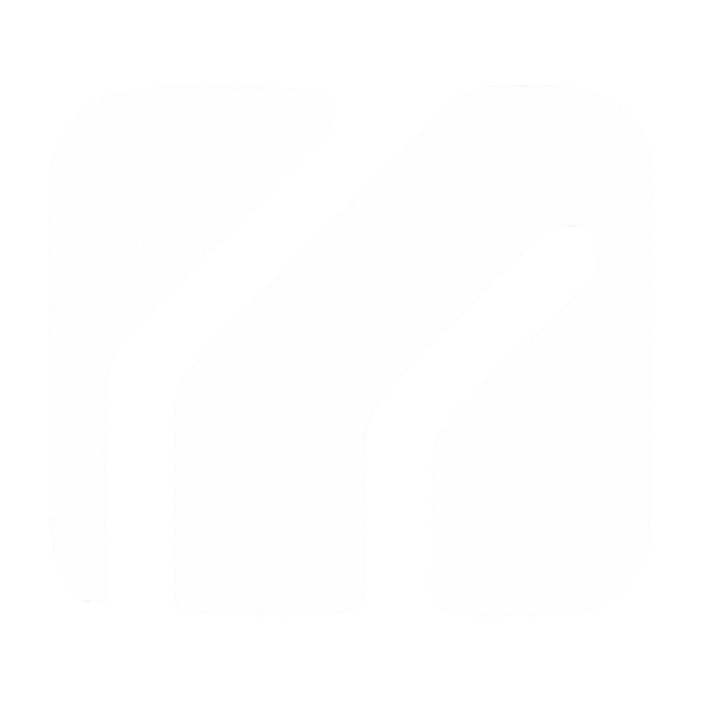

<p align="center">
  
</p>

<h1 align="center">Meranor Systems</h1>

<p align="center">
  <strong>Build what matters.</strong><br>
  Intelligent software, AI systems, and physical-operations technology designed to solve meaningful problems.
</p>

<p align="center">
  <a href="https://meranorsystems.github.io/">Website</a> ·
  <a href="https://meranorsystems.github.io/autonotrek/">AutonoTrek</a> ·
  <a href="https://meranorsystems.github.io/unosolu/">UnoSolu</a> ·
  <a href="https://meranorsystems.github.io/company/">Company</a>
</p>

---

## About this repository

This repository contains the public website for **Meranor Systems** and publishes directly through GitHub Pages from the root of the `main` branch.

**Live site:** https://meranorsystems.github.io/

The site is intentionally static, lightweight, and easy to audit:

- Semantic HTML
- Responsive CSS
- Vanilla JavaScript
- No Node, npm, bundler, CMS, analytics, or backend requirement

## Current public product direction

### AutonoTrek by Meranor

A modular physical-inventory intelligence platform for mapping inventory environments, collecting scan evidence, identifying location context, and producing reviewable results.

Current public foundation:

- **MSB-1** — modular sensing and computing unit
- **AutonoTrek Hand** — handheld carrier concept
- **AutonoTrek Control** — active software prototype

Air, Mast, and Dock are presented as future or dependency-deferred platform components—not shipping products.

### UnoSolu by Meranor

An AI-native business operating platform built around **Ask Uno** and the principle:

> Conversation leads. Structured software confirms.

UnoSolu is being defined as a standalone ERP/CRM and operations platform. AutonoTrek integration is planned as an optional licensed capability rather than a required dependency.

## Repository structure

```text
/
├── index.html                  Meranor Systems homepage
├── autonotrek/                 AutonoTrek public product page
├── unosolu/                    UnoSolu public product page
├── company/                    Company story and direction
├── founder/                    Founder page
├── contact/                    Public contact pathway
├── workshop/                   Archived public build notes and legacy project material
├── assets/                     Brand, product, founder, and interface media
├── styles.css                  Legacy shared styling
├── meranor-systems.css         Current Meranor Systems design system
└── app.js                      Progressive enhancement and responsive navigation
```

## Local preview

No build step is required.

```powershell
python -m http.server 8000
```

Then open:

```text
http://localhost:8000/
```

## Public-stage honesty

Meranor Systems distinguishes clearly between:

- active development
- software prototypes
- concept direction
- future carriers
- deferred dependencies

The public site should not be interpreted as a pricing catalog, availability statement, engineering drawing package, or claim that unreleased systems are ready to ship.

## Brand

The current Meranor Systems visual language uses:

- Charcoal and deep blue surfaces
- Stone-white typography and marks
- Restrained brass accents
- The Meranor recessed-flow makers mark

Primary brand mark:

```text
assets/brand/makers-mark-vector.png
```

---

<p align="center">
  <strong>Meranor Systems</strong><br>
  Intelligent technology. Built with intention.
</p>
